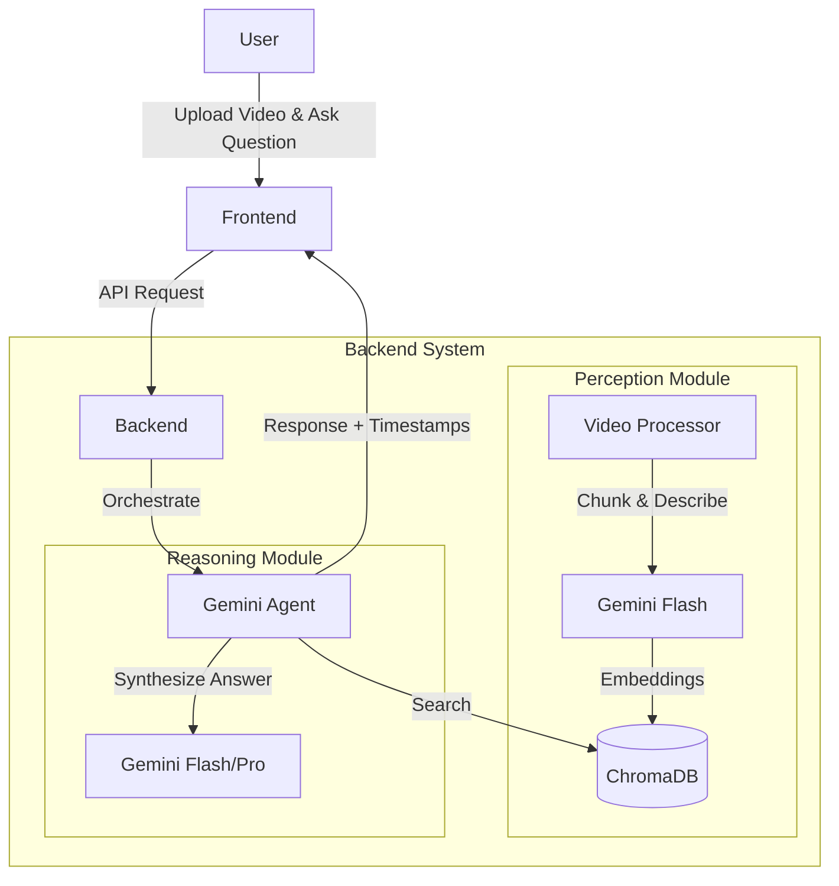

# Long-Video Human Motion Analysis Agent

A production-grade agentic system for analyzing human physical activity in long-form videos. This system uses a modular architecture that separates perception from reasoning, enabling efficient analysis of sports training, posture correction, gymnastics, and other physical activities.

[](https://www.python.org/downloads/)
[](LICENSE)

## 🎯 Project Overview [](https://app.arcade.software/share/So5c4zYey9EO218oKDI2)

This system answers natural language questions about human motion in videos by:
- **Temporal segmentation**: Divides video into 15-second chunks for efficient processing.
- **Motion analysis**: Uses Gemini 1.5 Flash to describe movement, safety, and mechanics.
- **Reasoning about technique**: Uses LLMs with grounded evidence from the video.
- **Providing explainable answers**: Returns natural language answers with specific timestamp citations.

### Example Queries
- *"Analyze the takeoff technique in this vault."*
- *"Is this squat safe according to coaching standards?"*
- *"What's the knee angle during the deepest part of the squat?"*
- *"Compare the form in the first 3 reps vs the last 3 reps."*

---

## 🏗️ System Architecture

### Design Philosophy

The system follows a **three-phase agentic approach** inspired by human video comprehension:

1. **Retrieve Phase**: Query understanding and relevant segment identification.
2. **Perceive Phase**: Dense motion extraction from selected segments using Gemini 1.5 Flash.
3. **Review Phase**: Reasoning over extracted data to generate grounded answers.



---

## 🔄 Data Flow

### 1. Ingestion Phase (Perception)
When a long video is uploaded:
1.  **Preprocessing**: The video is sliced into 15-second segments using FFmpeg.
2.  **Summarization**: Each segment is passed to **Gemini 1.5 Flash** to generate a dense textual description of movement and mechanics.
3.  **Embedding**: These descriptions are embedded and stored in **ChromaDB**, indexed by time range.

### 2. Query Phase (Reasoning)
When a user asks a question:
1.  **Retrieval**: The Agent queries ChromaDB to find the specific timestamps where relevant events occur.
2.  **Reasoning**: The system retrieves the text descriptions (evidence) and passes them to the LLM.
3.  **Response**: The system returns a natural language answer citing specific timestamps (e.g., *"At 0:12, the squat depth was sufficient..."*).

---

## 🔧 Technology Stack

- **Backend**: FastAPI (Python 3.11+)
- **Frontend**: Next.js + TypeScript
- **Vector Database**: ChromaDB
- **Models**: Google Gemini 1.5 Flash/Pro (via Vertex AI)
- **Containerization**: Docker + Docker Compose

---

## 🚀 Quick Start

### Prerequisites
- Docker & Docker Compose
- Google Cloud Project with Vertex AI API enabled.
- Service Account credentials in `backend/credentials.json`.

### Running the System
```bash
docker compose up --build
```
Access the application at `http://localhost:3000`.

---

## 🔐 CI/CD Pipeline

The project includes a robust GitHub Actions CI/CD pipeline (`.github/workflows/ci.yml`):

- **Secrets Scanning**: Uses `Gitleaks` to prevent accidental credential commits.
- **Backend CI**: Linting (`Ruff`), Security Audit (`Bandit`), and Testing (`Pytest`).
- **Frontend CI**: Linting (`ESLint`) and Build verification (`Next build`).
- **Docker**: Validates `docker-compose` and service builds.

---

## 🔑 Key Design Decisions

### 1. **Separation of Perception and Reasoning**
**Why**: Vision models are good at *what they see*, LLMs are good at *understanding what it means*.
- **Perception**: Gemini 1.5 Flash extracts raw descriptions (no interpretation).
- **Reasoning**: Gemini interprets motion data in context of coaching standards.

### 2. **Hierarchical Video Segmentation**
**Why**: Processing long videos frame-by-frame is computationally prohibitive.
- **Approach**: 15-second segments stored with embeddings.
- **Retrieval**: Only analyze segments relevant to the query.

### 3. **Vector Database for Temporal Search**
**Why**: Traditional search doesn't capture semantic meaning.
- **Solution**: ChromaDB with semantic embeddings.
- **Benefit**: Query "bad form" matches segments with poor technique descriptions even without exact keywords.

### 4. **Grounding in Evidence**
**Why**: Generic answers aren't useful for coaching.
- **Implementation**: Prompt engineering forces the model to cite evidence with timestamps and metrics.

---

## 📊 Performance & Scalability

- **Efficiency**: Video processing takes ~1-2s per second of video.
- **Scalability**: Uses ChromaDB for O(log n) retrieval of segments.
- **Optimization**: Caching and lazy loading are used to reduce redundant AI calls.

---

## 🛣️ Future Improvements

- [ ] Add confidence scores to all outputs.
- [ ] Implement comparative analysis (rep-to-rep).
- [ ] Add real-time pose landmark extraction via MediaPipe for biomechanical metrics.
- [ ] Support multi-person video analysis.

---

## 📝 Project Structure

```
.
├── backend/
│   ├── app/
│   │   ├── api/          # API Routes
│   │   ├── services/     # Video, Gemini, VectorDB logic
│   │   └── core/         # Config & Settings
│   ├── main.py
│   └── Dockerfile
├── frontend/
│   ├── app/              # Next.js Pages
│   └── components/       # React Components
├── docker-compose.yml
└── README.md
```
