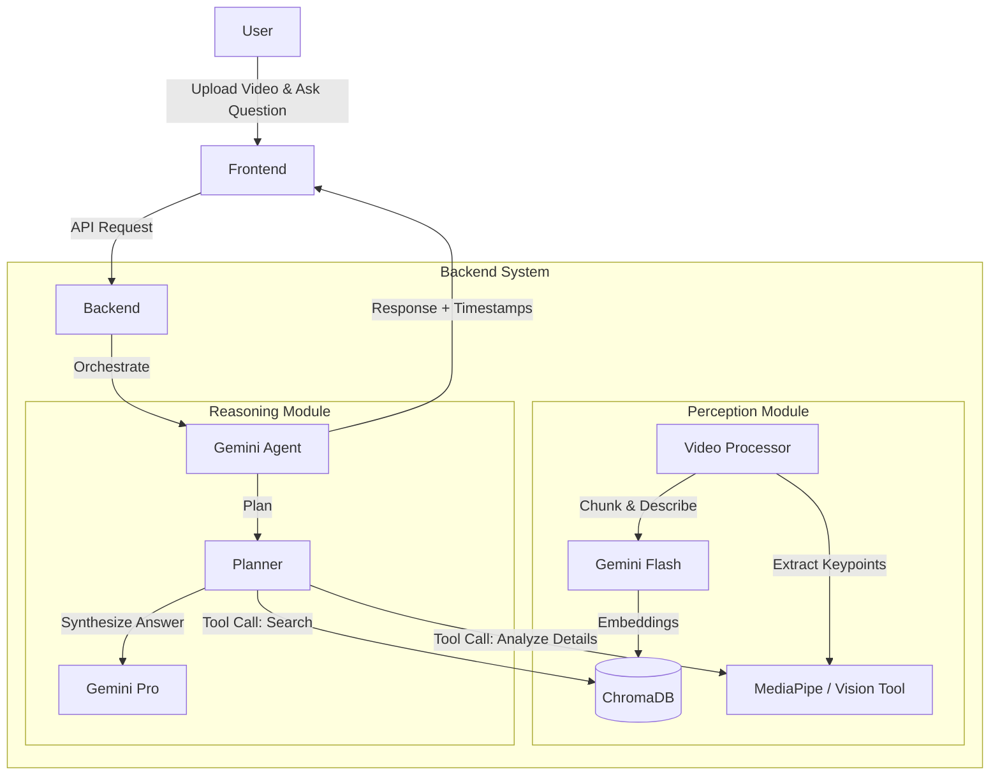

# Long-Video Human Motion Analysis Agent

This project implements an agentic system designed to analyze long-form videos of human physical activities (e.g., sports training, gymnastics). It uses a "Perception-Reasoning" split architecture to efficiently handle long videos without overflowing context windows, grounding its answers in specific timestamps and evidence.

## System Architecture

The system is composed of four main Dockerized services:

1.  **Frontend (Next.js)**: A clean web interface for video upload, chat interaction, and video playback.
2.  **Backend (FastAPI)**: The core application logic, hosting the Agent and managing API endpoints.
3.  **Vector Database (ChromaDB)**: Stores semantic embeddings of video segments for efficient retrieval.
4.  **Database (PostgreSQL)**: Stores session data, chat history, and raw video metadata.

### High-Level Design



## Data Flow

### 1. Ingestion Phase (Perception)
When a long video is uploaded:
1.  **Preprocessing**: The video is sliced into smaller, overlapping temporal segments (e.g., 30 seconds).
2.  **Summarization**: Each segment is passed to a fast Vision Model (Gemini 1.5 Flash) to generate a dense textual description of events (e.g., "Athlete prepares for vault," "Mid-air rotation," "Landing with stumble").
3.  **Embedding**: These descriptions are embedded and stored in **ChromaDB**, indexed by time range.

### 2. Query Phase (Reasoning)
When a user asks: *"Is the takeoff technique correct in the second vault?"*
1.  **Intent Analysis**: The Agent identifies the need to find specific events ("takeoff", "second vault").
2.  **Retrieval**: The Agent queries ChromaDB to find the specific timestamps where these events occur.
3.  **Deep Analysis**:
    - The Agent may zoom in on the retrieved timestamps.
    - It can call a **Pose Extraction Tool** to get specific angles (knee flexion, spine alignment) if the question requires biomechanical precision.
    - Alternatively, it passes the specific video clip (video-as-context) to the stronger **Gemini 1.5 Pro** model for a detailed critique.
4.  **Response**: The system returns a natural language answer citing the specific timestamp (e.g., *"At 12:04, the takeoff angle was too shallow..."*).

## Setup & Usage

### Prerequisites
- Docker & Docker Compose
- Google Cloud Vertex AI API Key

### Configuration
Environment variables are stored in `.env`. Ensure your `VERTEX_API_KEY` is set.

### Running the System
```bash
docker-compose up --build
```

Access the application at `http://localhost:3000`.

## Design Trade-offs & Decisions

- **Why ChromaDB?**: Parsing a 1-hour video frame-by-frame for every query is slow and expensive. We "index" the video first (Perception), allowing the Agent to "jump" to relevant parts (Reasoning) instantly.
- **Why Gemini 1.5?**: Its massive context window allows us to pass reasonably long clips (minutes) directly for analysis once retrieved, avoiding the complexity of strictly frame-based CV models for general understanding.
- **FastAPI + Next.js**: Chosen for speed, type safety (Pydantic), and modern interactive UI capabilities.
